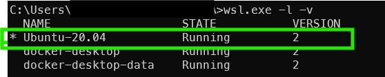
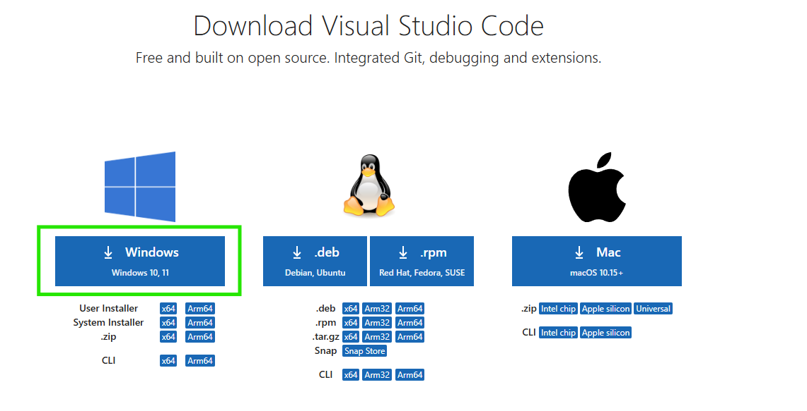
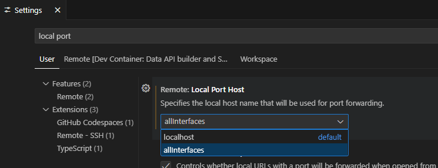
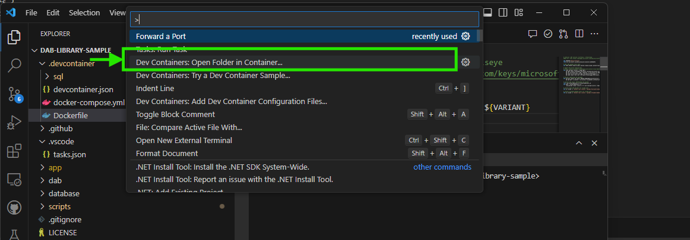

## Pre-reqs

### Download and Install

1. Install the **WSL2 Feature on Windows** (Windows SubSystem for Linux)
    1. https://learn.microsoft.com/windows/wsl/install
        1. In a Windows Command Prompt in **administrator** mode
        1. enter `wsl --install`
        1. confirm installation with `wsl.exe -l -v`
        1. 
1. Install **Docker Engine **
    1. https://docs.docker.com/desktop/install/windows-install/
    1. **Docker Desktop for Windows - x86_64**
    1. Follow the usual installation instructions to install Docker Desktop. Depending on which version of Windows you are using, Docker Desktop may prompt you to turn on WSL 2 during installation. Read the information displayed on the screen and turn on the WSL 2 feature to continue.
    1. Start Docker Desktop from the Windows Start menu.
    1. Navigate to Settings.
    1. From the General tab, select Use WSL 2 based engine.. If you have installed Docker Desktop on a system that supports WSL 2, this option is turned on by default.
    1. Select **Apply & Restart**.
1. Install **VSCode**
    1. https://code.visualstudio.com/download
    1. 
1. Update VSCode settings
    1. Navigate to File > Preferences > Settings
    1. Search for property **Remote: Local Port Host** and *update* the value to `allInterfaces`
    1. 
1. **Clone** the following repo (and checkout specific branch) to your local machine
    1. https://github.com/seantleonard/azure-sql-library-app-blazor (this is Sean's fork which includes bug fixes to primary repo maintained by another team)
    1. In a command prompt within a folder of your choice: 
        1. `git clone https://github.com/seantleonard/azure-sql-library-app-blazor dab-workshop`
        1. `cd dab-workshop`
        1. `git checkout dev/seantleonard/7_pull_newest_dotnet_dev_container_image`
        1. `code .` // opens VSCode given it is set in your PATH variable. otherwise, open vscode and open the cloned folder.
1. Build Sample and Deploy "DevContainer"
    1. Press <kbd>F1</kbd> and select the **Dev Containers: Open Folder in Container...** command.
    1. Select the cloned copy of this folder, wait for the container to start, and try things out!
    1. 
    1. Deployment takes about 10 minutes!
