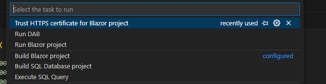
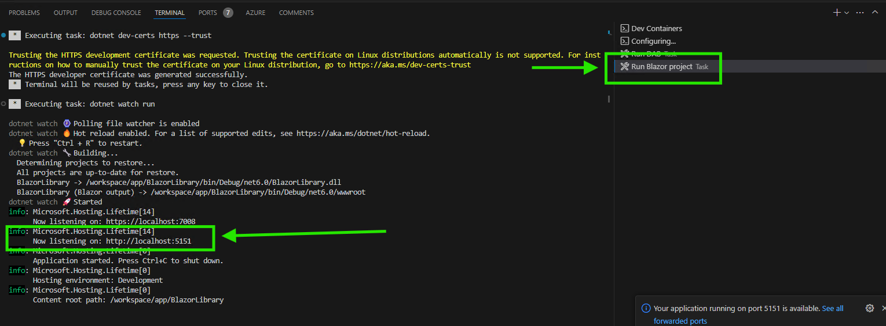
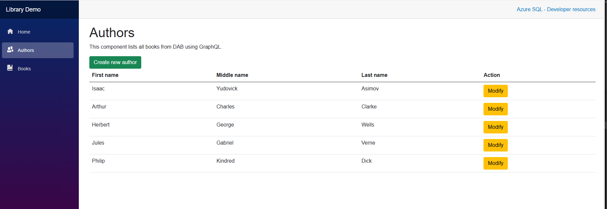
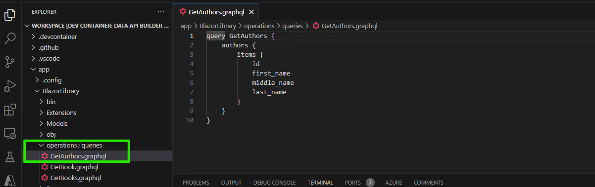

# Data API builder Workshop

1. See DAB in action within a real front end web application.
    - Explore how an existing application uses Graphql to fetch the data it needs
    - See how DAB is configured to publish a GraphQL endpoint to query your database tables.
2. Extend the web application to query a table that we create together in the workshop
    - Create a database table
    - Update DAB configuration by adding an entity to represent the database table.
    - Update Blazor front end code to query your new DAB "entity" to fetch table data using GraphQL

## Make sure environments are deployed:

1. Press <kbd>F1</kbd> and select the **Tasks: Run Task** command.
    1. 
    2. **Trust HTTPS certificate for Blazor project**
        1. Press <kbd>ESC</kbd> to exit out of the log selection window and task will start.
    1. **Run DAB**
    1. **Run Blazor project**
1. View webapp in host machine at HTTP endpoint: `https://localhost:5151` or whichever port is published by Blazor
    1. 
1. Update dotnet sdk location in vscode settings for db projects
    1. Settings > Workspace > Sql Database Projects: Dotnet SDK Location
        1. /usr/share/dotnet

## Explore App

View the Authors page to see all authors from the Library database table `Authors` load:


View the Blazor GraphQL request for the authors page **RepoCloneRoot/app/BlazorLibrary/operations/queries/GetAuthors.graphql**


## Update Database

In **RepoCloneRoot/.devcontainer/sql/library.azure-sql.sql**, we're going to add a new table and insert data
```sql
CREATE TABLE [dbo].[movies] (
    [id]    INT             DEFAULT (NEXT VALUE FOR [dbo].[globalId]) NOT NULL,
    [title] NVARCHAR (1000) NOT NULL,
    [year]  INT             NULL,
    [cover_img_url] NVARCHAR (200) NULL,
    PRIMARY KEY CLUSTERED ([id] ASC)
);

insert into [dbo].[movies]
values
  (1, 'Titanic', '1997', 'https://m.media-amazon.com/images/I/71ZJ8am0mKL._AC_SL1340_.jpg'),
  (2, 'Up', '2009', 'https://m.media-amazon.com/images/I/5182qWG3BFL.jpg');
GO
```

Run in dev container terminal
```sh
.devcontainer/sql/postCreateCommand.sh P@ssw0rd! './bin/Debug/' './.devcontainer/sql/'
```

## Update DAB runtime config (dab.config.json)

## Update Blazor App

Add a file named `Movies.razor` under **app/BlazorLibrary/Pages**
```csharp
@page "/movies"

<PageTitle>Movies</PageTitle>

<h1>Movies</h1>
<p>This component lists all movies from DAB using GraphQL.</p>
<a href="@($"/addbook")" class="btn btn-success">Create new movie</a>
<UseGetMovies Context="result">
    <ChildContent>
        <table class="table">
            <thead>
                <tr>
                    <th>Title</th>
                    <th>Year</th>
                    <th>CoverImage</th>
                </tr>
            </thead>
            <tbody>
                @foreach (var movie in result.Movies.Items)
                {
                    <tr>
                        <td>@movie.Title</td>
                        <td>@movie.Year</td>
                        <td>
                        @*  *@
                        </td>
                    </tr>
                }
            </tbody>
        </table>
    </ChildContent>
</UseGetMovies>
```

Update the GraphQL Schema file:
```graphql
type Movie {
  id: Int!
  title: String!
  year: Int
  cover_img_url: String
}

"The return object from a filter query that supports a pagination token for paging through results"
type MovieConnection {
  "The list of items that matched the filter"
  items: [Movie!]!
  "A pagination token to provide to subsequent pages of a query"
  endCursor: String
  "Indicates if there are more pages of items to return"
  hasNextPage: Boolean!
}
```

and in `type Query {...}` add the line:
```graphql
  movies() : MovieConnection!
```

In NavMenu.razor, add a navigation item for the new Movies page

Under Services folder add a new file named `MovieService.cs` with contents
```csharp
// BookService.cs
using System;
using System.Collections.Generic;
using System.Net.Http;
using System.Net.Http.Json;
using System.Text.Json;
using System.Threading.Tasks;
using BookManagementApp.Models;
using BookManagementApp.Extensions;

namespace BookManagementApp.Services
{
    public class MovieResponse
    {
        public List<Movie> Value { get; set; }
    }

    public class MovieService
    {
        private readonly HttpClient _httpClient;
        private string ApiUrl = "";

        public MovieService(HttpClient httpClient, IConfiguration Configuration)
        {
            _httpClient = httpClient;
            ApiUrl = Configuration.GetValue<string>("ApiUrl");
        }
    }
}
```
